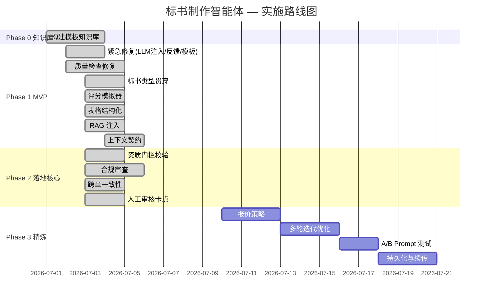

# 产品需求文档（PRD）— 标书制作智能体

> **文档版本**：v1.0  
> **创建日期**：2026-07-04  
> **产品代号**：Bid Agent  
> **文档状态**：待评审  

---

## 一、产品概述

### 1.1 产品定位

标书制作智能体（Bid Agent）是一款面向企业投标部门的 **AI 驱动标书初稿生成系统**。它通过大语言模型（LLM）自动解析招标文件、提取评分要求、匹配历史模板、生成结构完整的标书初稿，并支持基于反馈的精准微调，最终导出符合招标格式要求的 DOCX 文件。

**一句话定位**：把标书初稿撰写从「3-5 个工作日」压缩到「10 分钟」，让人聚焦于审阅和策略优化。

### 1.2 产品边界

| ✅ 包含 | ❌ 不包含 |
|---------|----------|
| 招标文件解析与需求提取 | 自动投标提交或招标平台对接 |
| 标书初稿生成（8 章 / 20,000 字） | 竞争对手分析与报价策略建议 |
| 基于反馈的精准微调 | 多用户协作与权限管理 |
| 质量检查与评分模拟 | 移动端或小程序 |
| 跨章节一致性校验 | 语音输入反馈 |
| 合规审查（格式 + 法律） | 模板在线市场或社区共享 |
| 人工审核卡点 | Phase 1 商业化功能（计费、账户、License） |
| DOCX 导出 | — |

### 1.3 目标用户

| 用户角色 | 核心诉求 | 使用场景 |
|---------|---------|---------|
| **投标负责人**（主要用户） | 快速生成结构完整的标书初稿，减少重复劳动 | 收到招标文件后，上传 → 生成 → 审阅 → 微调 → 导出 |
| **投标专员** | 针对特定章节提交修改意见，精准微调 | 在生成的初稿上选中段落 → 输入反馈 → 系统定向修改 |
| **技术使用者**（次要用户） | 灵活配置不同 LLM 供应商和模型 | 在配置面板切换模型、测试 API 连接 |

---

## 二、需求背景

### 2.1 行业痛点

传统标书撰写流程存在三大核心矛盾：

| 痛点 | 现状描述 | 量化影响 |
|------|---------|---------|
| **效率瓶颈** | 一份 2 万字的完整标书初稿需要 3-5 个工作日，大部分精力花在重复性格式填充和基础内容组织上 | 人力成本高、投标响应速度慢 |
| **质量不稳定** | 人手撰写的标书常常遗漏评分项、格式不统一、前后数据矛盾，每次投标需要大量人工校验 | 评分项遗漏率 > 20%，废标风险高 |
| **知识无法沉淀** | 历史中标标书和优质模板缺乏系统管理手段，写标书时"翻旧文档"效率低下 | 经验无法复用，新人上手慢 |

### 2.2 产品价值

AI 驱动的标书生成不是「一键生成立即投标」，而是：

1. **效率跃升**：把初稿生成从天级压缩到分钟级（< 10 分钟 / 8 章 / 20,000 字）
2. **人机协作**：把人从低级重复劳动中解放出来，聚焦于审阅和策略优化
3. **知识沉淀**：把企业标书知识沉淀为可检索、可复用的数字资产（FAISS 向量索引）
4. **精准迭代**：支持基于反馈的定向微调，而非每次重写全文
5. **质量保障**：三道校验关（内容质量 + 跨章节一致性 + 合规审查）+ 人工审核卡点

### 2.3 竞品分析

| 维度 | 传统人工撰写 | 通用 AI 工具（如 ChatGPT） | 本产品 |
|------|------------|--------------------------|--------|
| 招标文件解析 | 人工阅读 | 需手动粘贴文本 | 自动解析 PDF/DOCX + 表格结构化 |
| 评分项覆盖 | 人工逐条核对 | 无保障 | 自动提取评分项 + 质量检查覆盖率 |
| 全篇一致性 | 依赖人工校验 | 各章独立生成、易矛盾 | 项目上下文契约 + 跨章节校验 |
| 历史经验复用 | 翻旧文档 | 无 | FAISS 检索历史中标方案 + RAG 注入 |
| 合规审查 | 人工检查 | 无 | 绝对化用语 / 虚假业绩自动检测 |
| 输出格式 | 人工排版 | 纯文本 | 符合政府采购格式的 DOCX |
| 评分预估 | 无 | 无 | 模拟评审打分 + 薄弱环节提示 |

---

## 三、产品架构

### 3.1 系统架构总览

```
┌─────────────────────────────────────────────────────────┐
│                    Streamlit GUI 层                      │
│  ┌──────────┐  ┌──────────┐  ┌──────────┐  ┌────────┐ │
│  │ 上传面板  │  │ 审阅面板  │  │ 配置面板  │  │导出面板 │ │
│  └────┬─────┘  └────┬─────┘  └────┬─────┘  └───┬────┘ │
├───────┼──────────────┼──────────────┼─────────────┼──────┤
│       │     Pipeline Runner（管道运行器）     │     │
│       │     ┌────────────────────────────┐     │     │
│       │     │   LangGraph StateGraph     │     │     │
│       │     │    （14 节点状态机）        │     │     │
│       │     └────────────────────────────┘     │     │
├───────┼──────────────────────────────────────────┼──────┤
│       │            核心引擎层                    │     │
│  ┌────▼──────────────────────────────────────────▼────┐ │
│  │  DocumentParser → ReqExtractor → ContractExtractor │ │
│  │  → EligibilityChecker → TemplateMatcher            │ │
│  │  → SectionGenerator → QualityChecker               │ │
│  │  → CrossReferenceChecker → ComplianceChecker       │ │
│  │  → ScoreSimulator → HumanReviewGate                │ │
│  │  → DocumentAssembler                               │ │
│  └─────────────────────────────────────────────────────┘ │
├─────────────────────────────────────────────────────────┤
│                    基础设施层                            │
│  ┌──────────┐  ┌──────────┐  ┌──────────┐  ┌────────┐ │
│  │FAISS索引  │  │ LLM 适配器│  │ 知识库    │  │DOCX引擎│ │
│  └──────────┘  └──────────┘  └──────────┘  └────────┘ │
└─────────────────────────────────────────────────────────┘
```

### 3.2 技术栈

| 层级 | 技术选型 | 说明 |
|------|---------|------|
| **编排框架** | LangGraph StateGraph | 14 节点状态机，支持条件路由、并行生成、反馈循环 |
| **前端 UI** | Streamlit | Python 原生 Web 框架，4 个面板（上传/审阅/配置/导出） |
| **LLM 适配** | 多供应商适配器 | 支持 DeepSeek、OpenAI、Claude 等，`functools.partial` 注入 |
| **向量检索** | FAISS (faiss-cpu) | 历史标书语义检索 + 模板匹配 |
| **文档解析** | PyMuPDF (fitz) + python-docx | PDF/DOCX 解析 + 表格结构化提取 |
| **文档导出** | python-docx | DOCX 装配，仿宋/黑体字体，政府采购格式 |
| **状态管理** | TypedDict (AgentState) | LangGraph 统一状态对象，单数据源 |
| **编程语言** | Python 3.11+ | — |
| **运行平台** | 本地桌面（macOS / Windows / Linux） | Phase 1 数据不出本地 |

### 3.3 管道流程（14 节点）

```
DocumentParser ──[FAIL]──→ END
     │
 [SUCCESS]
     ↓
ReqExtractor ──[FAIL]──→ END
     │
 [SUCCESS]
     ↓
ContractExtractor ──→ EligibilityChecker ──[FAIL]──→ END
                                           │
                                      [PASS/WARNING]
                                           ↓
                                    TemplateMatcher
                                           ↓
                                  SectionGenerator（并行 8 章）
                                           ↓
                                    QualityChecker
                                     │          │
                                [PASS]       [FAIL]
                                     │          │
                                     ↓     FeedbackProcessor ──→ SectionGenerator（重试循环）
                            CrossReferenceChecker
                                     │          │
                                [PASS]       [FAIL] → FeedbackProcessor
                                     ↓
                              ComplianceChecker
                                     │          │
                                [PASS]       [FAIL] → FeedbackProcessor
                                     ↓
                                ScoreSimulator
                                     │
                                     ↓
                              HumanReviewGate ──[REJECT]──→ FeedbackProcessor
                                     │
                                [APPROVE]
                                     │
                                     ↓
                              DocumentAssembler → END
```

---

## 四、功能需求

### 4.1 P1 — 核心功能（MVP 必须完成）

#### 功能 4.1.1：招标文件上传与解析

| 属性 | 描述 |
|------|------|
| **用户故事** | 作为投标负责人，我希望把招标文件上传后，系统能自动解析内容，这样我不需要手动复制粘贴 |
| **优先级** | P1 |
| **所属节点** | DocumentParser |

**功能描述**：
- 支持上传 PDF、DOCX、DOC 格式的招标文件，支持多文件同时上传
- 自动解析文件内容为纯文本，提取表格结构化数据（评分表、资质表）
- 解析失败时（如扫描件 PDF）提示用户重新上传或手动输入关键信息
- 解析成功后进入需求提取阶段

**输入**：用户上传的文件（PDF/DOCX/DOC）  
**输出**：`documents`（文件名 + 文本内容 + 文件类型）、`extracted_tables`（结构化表格）

**验收标准**：
1. 给定一份 80 页的服务类招标文件 PDF，当用户上传后，系统在 30 秒内完成解析，提取出全部文本内容和评分表
2. 给定上传了格式损坏的 PDF（扫描件），当系统尝试解析，提示用户该文件可能不可读并要求重新上传
3. 给定一份包含评分表的 PDF，系统提取出结构化的评分项列表（评分项名称、分值、评审因素）

---

#### 功能 4.1.2：招标需求自动提取

| 属性 | 描述 |
|------|------|
| **用户故事** | 作为投标负责人，我希望系统能自动识别招标文件中的评分标准、资质要求和技术规格，这样我不会遗漏关键评分项 |
| **优先级** | P1 |
| **所属节点** | ReqExtractor |

**功能描述**：
- 从解析后的文档内容中，使用 LLM 提取评分项（名称、分值、评审因素）
- 优先消费 DocumentParser 提取的结构化表格数据（评分表），跳过 LLM 调用
- 提取资质要求（企业资质门槛、人员资质要求）
- 提取技术规格（技术参数、服务标准）
- 提取格式要求（页边距、字体、行距等）
- 提取失败时终止管道，避免生成无的放矢的标书

**输入**：`documents`（解析后的文本）、`extracted_tables`（结构化表格）  
**输出**：`requirements`（评分项列表、资质要求、技术规格、格式规则）

**验收标准**：
1. 给定招标文件中包含 15 条评分标准，当系统完成需求提取，提取结果准确识别出所有评分项、分值和评审因素，遗漏率 < 10%
2. 给定招标文件包含结构化评分表，系统直接从表格提取数据，不调用 LLM
3. 给定需求提取失败（LLM 返回非 JSON），系统标记节点为 FAILED 并终止管道

---

#### 功能 4.1.3：项目上下文契约构建

| 属性 | 描述 |
|------|------|
| **用户故事** | 作为投标负责人，我希望标书全篇的项目名称、投标人、项目地点等关键信息完全一致，不会被评审专家发现矛盾 |
| **优先级** | P1 |
| **所属节点** | ContractExtractor |

**功能描述**：
- 从用户上传页面填写的「项目基本信息」（投标人名称、招标人名称、项目地点、工期）提取结构化字段
- 从用户「补充说明」自由文本中，调用 LLM 提取结构化信息（投标人、项目名称、项目地点、行业属性、工期、质保期等），并将策略性要求改写为规范的项目说明
- 从招标文件提取的信息（ReqExtractor 输出）进行交叉验证
- **三方合并优先级**：表单字段（用户显式填写）> 招标文件提取 > LLM 从补充说明提取
- 构建不可变的 `ProjectContextContract`，注入每章生成 prompt，确保全篇一致
- 自动推断禁止出现项（防止拼凑残留，如错误出现其他项目的机构名/行业属性）

**输入**：`extra_reqs`（补充说明）、`requirements`（招标文件提取结果）、`bid_type`（标书类型）、表单字段  
**输出**：`project_contract`（契约数据）、`global_constraints`（全局约束）

**验收标准**：
1. 给定用户补充说明"投标公司为广州华南人力有限公司，项目在广州，工期12个月"，当 ContractExtractor 处理后，提取出 `bidder_name=广州华南人力有限公司`、`project_location=广州`、`duration=12个月`
2. 给定用户在表单填写投标人名称为"XX公司"，同时补充说明中也提到该公司，契约中 `bidder_name` 以表单填写为准
3. 给定契约构建完成，SectionGenerator 每章 prompt 中包含契约摘要，8 章中项目名称/投标人/项目地点完全一致

---

#### 功能 4.1.4：标书初稿生成

| 属性 | 描述 |
|------|------|
| **用户故事** | 作为投标负责人，我希望系统自动生成一份包含全部章节的标书初稿，这样我不需要从零开始逐章手写 |
| **优先级** | P1 |
| **所属节点** | TemplateMatcher + SectionGenerator |

**功能描述**：
- **模板匹配**：根据标书类型（服务/货物/工程/集成/运维/劳务），从知识库中检索最匹配的模板（FAISS 语义检索 + 文件系统关键词检索双模式）
- **章节生成**：并行生成 8 个章节（投标函、授权委托书、服务方案、技术方案、人员配置、公司资质与业绩、实施计划、售后服务承诺）
- **RAG 注入**：每章生成时，从知识库检索同类型历史中标方案的优质段落，注入 prompt 作为参考
- **契约注入**：每章 prompt 注入项目上下文契约摘要，确保关键信息一致
- **评分对齐**：每章 prompt 包含招标文件评分要求，确保逐条响应评分项
- **类型适配**：根据标书类型选择差异化的 prompt 策略（如劳务管理服务类使用真实标书 7 子节结构）
- **并行错误隔离**：单章生成失败不影响其他章节，失败章使用错误占位符

**输入**：`requirements`、`selected_template_id`、`bid_type`、`project_contract`、`feedback_history`  
**输出**：`sections`（章节名 → 内容映射）

**验收标准**：
1. 给定一份服务类招标文件 PDF（约 80 页），当用户上传文件并选择「服务类」模板，系统在 10 分钟内生成一份包含全部 8 章的标书初稿，每章不少于 500 字
2. 给定标书类型为"劳务管理服务类"，SectionGenerator 使用真实标书 7 子节结构（概述/目标/团队/职责/保障/背景/承诺）生成服务方案
3. 给定知识库中有同类型范文，生成内容中融入了历史标书中的表述模式
4. 给定某章 LLM 调用超时，其他章节正常生成，失败章显示错误占位符

---

#### 功能 4.1.5：质量检查与反馈微调

| 属性 | 描述 |
|------|------|
| **用户故事** | 作为投标负责人，在查看生成的标书初稿后，我希望能针对特定章节提交修改意见，系统能精准修改目标位置而不影响其他内容 |
| **优先级** | P1 |
| **所属节点** | QualityChecker + FeedbackProcessor + SectionGenerator（反馈循环） |

**功能描述**：
- **质量检查**：
  - 检查每章内容是否覆盖评分项（完整度），每章至少检查 8000 字
  - 输出 0-100 分 + 分类问题清单（完整度/合规度/一致度）
  - 非 JSON 响应不再静默 PASS，重试 1 次仍失败则判定 FAIL
- **反馈处理**：
  - 将质量问题分类为：`content_fix`（内容修正）、`style_adjust`（风格调整）、`structure`（结构优化）、`score_align`（评分对齐）
  - 识别问题作用域：`global`（全篇）或 `local`（特定章节/段落）
  - 提取目标章节名称
- **定向修订**：
  - 仅对有反馈的章节强制重新生成，不影响其他章节
  - 支持多轮迭代（默认 3 轮，可配置 1-5 轮）
  - 达到最大轮次后强制通过，进入校验链

**输入**：`sections`、`requirements.scoring`、`feedback_history`  
**输出**：`quality_report`（判定/完整度/合规/一致性问题）、`feedback_history`（反馈记录）、更新后的 `sections`

**验收标准**：
1. 给定标书第 3 章第 2 段包含「项目团队配置」描述，当用户提交反馈"补充项目经理张三年限和证书编号"，系统仅修改该章节，重新生成的内容包含年限和证书信息，且其他章节未发生变化
2. 给定标书遗漏了 2 条评分项，当执行质量检查，系统输出报告列出遗漏项所在评分条目的原文引述和对应应写的章节
3. 给定用户在同一章节提交了 3 轮反馈，当查看版本历史，系统展示每次修改的 diff 记录
4. 给定用户提交了模糊反馈「整体太啰嗦了」，系统请求用户指定具体章节或段落

---

#### 功能 4.1.6：DOCX 导出

| 属性 | 描述 |
|------|------|
| **用户故事** | 作为投标负责人，我希望标书定稿后能导出为符合招标格式要求的 DOCX 文件 |
| **优先级** | P1 |
| **所属节点** | DocumentAssembler |

**功能描述**：
- 将生成的各章节内容装配为完整的 DOCX 文件
- 自动生成目录、连续页码、正确的标题层级
- 字体为仿宋/黑体（符合政府采购格式要求）
- 支持页眉页脚

**输入**：`sections`、`requirements.format_rules`  
**输出**：DOCX 文件（下载）

**验收标准**：
1. 给定标书质量检查全部 PASS，当点击导出 DOCX，下载的文件包含自动生成的目录、连续的页码、正确的标题层级
2. 给定招标文件要求页边距上 3.7cm，导出的 DOCX 页边距符合要求

---

### 4.2 P2 — 落地核心功能

#### 功能 4.2.1：资质门槛校验（Go/No-Go 门禁）

| 属性 | 描述 |
|------|------|
| **用户故事** | 作为投标负责人，我希望系统在上传招标文件后立即检查我们公司的资质是否满足门槛，如果不满足就直接告知，避免浪费时间和成本生成无用的标书 |
| **优先级** | P2 |
| **所属节点** | EligibilityChecker |

**功能描述**：
- 从招标文件提取的资质要求与企业资质库（本地 JSON）进行比对
- 输出三种判定：
  - `PASS`：资质完全满足 → 继续生成
  - `WARNING`：部分资质缺失但有替代方案 → 暂停等待用户确认
  - `FAIL`：硬门槛不满足 → **终止管道**，避免浪费生成成本
- 门禁逻辑：FAIL 直接路由到 END，不执行后续 10 个节点

**输入**：`requirements.qualifications`、企业资质库（`data/company_quals.json`）  
**输出**：`eligibility_report`（判定/缺失资质/匹配资质/风险等级）

**验收标准**：
1. 给定招标文件要求 ISO27001 认证，企业资质库中无此认证，当 EligibilityChecker 执行后，判定为 FAIL，管道终止
2. 给定企业资质完全满足招标要求，判定为 PASS，管道正常继续

---

#### 功能 4.2.2：跨章节一致性校验

| 属性 | 描述 |
|------|------|
| **用户故事** | 作为投标负责人，我希望系统能自动检测各章节之间的数据矛盾（如人员配置章说 15 人，服务方案章说 12 人），避免被评审专家扣分 |
| **优先级** | P2 |
| **所属节点** | CrossReferenceChecker |

**功能描述**：
- 检查人员数量跨章节一致（人员配置章 vs 服务方案章）
- 检查技术参数跨章节一致（技术方案章 vs 服务方案章）
- 检查时间节点跨章节一致（实施计划章 vs 服务方案章）
- 检查金额跨章节一致（报价章 vs 其他章）
- 基于 `ProjectContextContract` 校验项目名称、投标人、行业属性等是否偏离契约
- 检测拼凑残留（禁止出现的机构名/行业属性）
- FAIL → 路由到 FeedbackProcessor 进行定向修订

**输入**：`sections`、`project_contract`  
**输出**：`cross_ref_report`（判定/不一致项列表）

**验收标准**：
1. 给定第 5 章人员配置写"15人"，第 3 章服务方案写"12人"，当 CrossReferenceChecker 执行后，报告 inconsistency: number_mismatch, field=项目人员数量
2. 给定某章出现契约禁止的机构名（如"复旦大学"出现在非复旦项目中），标记为 CRITICAL: contract_forbidden_institution

---

#### 功能 4.2.3：合规审查（格式 + 法律）

| 属性 | 描述 |
|------|------|
| **用户故事** | 作为投标负责人，我希望系统自动检查标书中是否有绝对化用语（"全国第一"）、虚假业绩等法律风险，避免废标或中标后被取消资格 |
| **优先级** | P2 |
| **所属节点** | ComplianceChecker |

**功能描述**：
- **格式合规**：检查页边距、字体、行距、目录格式、附件顺序、页眉页脚
- **法律合规**：
  - 绝对化用语检测（"全国第一"、"唯一"、"最佳"）→ 违反广告法
  - 虚假业绩检测（无对应合同的项目）→ 违反招标投标法
  - 知识产权检测（未授权使用他人案例/图片）
  - 保密信息泄露检测（客户名称未脱敏）
- 使用上下文敏感的正则匹配避免误报（如"第一"在"第一名投标候选人"中合法）
- FAIL → 路由到 FeedbackProcessor 进行定向修订

**输入**：`sections`、`requirements.format_rules`  
**输出**：`compliance_report`（判定/格式问题列表/法律问题列表）

**验收标准**：
1. 给定标书某章节出现「全国第一」，当执行合规性检查，系统标记违禁词位置并建议替换方案
2. 给定"第一名投标候选人"出现在标书中，系统不误报为绝对化用语

---

#### 功能 4.2.4：评分模拟

| 属性 | 描述 |
|------|------|
| **用户故事** | 作为投标负责人，我希望系统能预估标书得分，告诉我哪些评分项是薄弱环节，这样我知道该重点修改哪里 |
| **优先级** | P2 |
| **所属节点** | ScoreSimulator |

**功能描述**：
- 模拟评审专家打分，按评分标准逐项预测得分
- 输出每项的预测得分、差距（gap）、改进建议
- 输出总分预测和排名预估（前3/中上/中等/偏后）
- 支持两种模式：
  - LLM 模式：调用 LLM 进行精确评分
  - 启发式模式（无 LLM 时）：基于内容覆盖率和篇幅长度估算

**输入**：`sections`、`requirements.scoring`  
**输出**：`score_simulation`（逐项得分/总分/排名预估/方法）

**验收标准**：
1. 给定标书有 10 个评分项（满分 100），ScoreSimulator 输出每项预测得分和 gap，总分 = 各项之和
2. 给定某评分项内容完全缺失，预测得分为 0，gap = 满分，suggestion 提示改进建议
3. 给定无 LLM 配置，系统使用启发式模式估算得分并标注 method=heuristic

---

#### 功能 4.2.5：人工审核卡点

| 属性 | 描述 |
|------|------|
| **用户故事** | 作为投标负责人，我希望在标书导出前能进行最终人工审核，确认内容无误后再导出，因为投标文件需要法定代表人签字，最终责任由人承担 |
| **优先级** | P2 |
| **所属节点** | HumanReviewGate |

**功能描述**：
- 在评分模拟之后、文档装配之前暂停管道
- GUI 展示生成的章节内容、预测得分、质量报告
- 用户可选择：
  - `approved`（通过）→ 继续文档装配和导出
  - `rejected`（驳回）→ 附带审核意见返回 FeedbackProcessor 修订
- 审核意见自动转换为 `feedback_history` 条目，供 FeedbackProcessor 处理
- 幂等设计：已有 verdict 不被覆盖，支持 GUI 二次 invoke

**法律依据**：招标投标法第二十七条规定投标文件需由法定代表人或授权代理人签字并加盖公章。完全自动化在法律层面不可接受。

**输入**：`sections`、`score_simulation`、`quality_report`  
**输出**：`review_status`（pending/approved/rejected）、`review_comments`

**验收标准**：
1. 给定管道运行到 HumanReviewGate，当自动审核模式（测试用），节点返回 approved，继续 DocumentAssembler
2. 给定管道运行到 HumanReviewGate，当交互模式，节点返回 pending，管道暂停等待人工输入
3. 给定用户驳回并附带意见"第 3 章缺少应急响应流程"，意见被转换为 feedback_history 条目，路由到 FeedbackProcessor

---

#### 功能 4.2.6：多模型供应商配置

| 属性 | 描述 |
|------|------|
| **用户故事** | 作为技术使用者，我希望能在界面中选择不同的 LLM 供应商和模型，并为不同的任务配置不同的模型 |
| **优先级** | P2 |
| **所属节点** | 配置面板 + LLM 适配器 |

**功能描述**：
- 配置面板支持输入 LLM API Key（DeepSeek、OpenAI、Claude 等）
- 支持为不同节点配置不同模型（如生成用 GPT-4o、质检用 Claude）
- API Key 在内存中暂存，不持久化到磁盘
- 支持测试连接功能

**验收标准**：
1. 给定用户输入了 DeepSeek API Key，当选定 DeepSeek 作为默认模型并启动生成，SectionGenerator 节点使用 DeepSeek-Chat
2. 给定用户配置了「质量检查节点使用 Claude」，生成完成后自动触发质量检查使用 Claude，而 SectionGenerator 仍使用默认模型
3. 给定用户输入了无效的 API Key，当点击「测试连接」，系统返回连接失败及具体错误原因

---

### 4.3 P3 — 增强功能（远期迭代）

#### 功能 4.3.1：FAISS 知识库检索增强

| 属性 | 描述 |
|------|------|
| **优先级** | P3 |
| **状态** | 已实现基础版（RAG 注入 SectionGenerator） |

**功能描述**：
- 上传历史中标标书 → 系统建立 FAISS 索引
- 新生成标书时自动检索相关段落 → 注入生成 prompt
- 标书质量持续进化，新标书复用已有成功经验
- 支持模板库（6 种标书类型 × 3 套模板 = 18 套）

---

#### 功能 4.3.2：报价策略（PricingStrategist）

| 属性 | 描述 |
|------|------|
| **优先级** | P3 |
| **状态** | 规划中 |

**功能描述**：
- 成本核算 + 竞争定价 + 资金占用分析
- 输出建议报价、利润率、策略依据

---

#### 功能 4.3.3：多轮迭代优化

| 属性 | 描述 |
|------|------|
| **优先级** | P3 |
| **状态** | 规划中 |

**功能描述**：
- 自动执行多轮生成 → 评分 → 修订循环
- 选择最高分版本导出
- A/B Prompt 测试：同一章节用 2 种 prompt 策略生成，自动选择高分版本

---

#### 功能 4.3.4：管道持久化与断点续传

| 属性 | 描述 |
|------|------|
| **优先级** | P3 |
| **状态** | 规划中 |

**功能描述**：
- 每阶段保存 checkpoint 到 SQLite
- 支持查看历史运行记录
- 重启后从断点继续
- 支持比较不同次运行的结果

---

## 五、数据模型

### 5.1 核心状态对象（AgentState）

管道所有节点共享的统一状态对象：

| 字段 | 类型 | 说明 | 生产节点 |
|------|------|------|---------|
| `documents` | `list[dict]` | 上传的文件及解析内容 | DocumentParser |
| `extracted_tables` | `list[dict]` | 结构化表格数据 | DocumentParser |
| `bid_type` | `str` | 标书类型（服务/货物/工程等） | 用户输入 |
| `extra_reqs` | `str` | 用户补充说明 | 用户输入 |
| `project_contract` | `dict` | 项目上下文契约 | ContractExtractor |
| `requirements` | `dict` | 提取的需求（评分项/资质/技术规格/格式规则） | ReqExtractor |
| `eligibility_report` | `dict` | 资质校验报告 | EligibilityChecker |
| `matched_templates` | `list[str]` | 匹配的模板 ID 列表 | TemplateMatcher |
| `selected_template_id` | `str` | 选定模板 ID | TemplateMatcher |
| `sections` | `dict[str, str]` | 章节名 → 生成内容 | SectionGenerator |
| `quality_report` | `dict` | 质量检查报告 | QualityChecker |
| `cross_ref_report` | `dict` | 跨章节一致性报告 | CrossReferenceChecker |
| `compliance_report` | `dict` | 合规审查报告 | ComplianceChecker |
| `score_simulation` | `dict` | 评分模拟结果 | ScoreSimulator |
| `review_status` | `str` | 人工审核状态 | HumanReviewGate |
| `feedback_history` | `list[dict]` | 反馈历史记录 | FeedbackProcessor |
| `current_round` | `int` | 当前修订轮次 | FeedbackProcessor |
| `max_rounds` | `int` | 最大修订轮次（默认 3） | 用户配置 |
| `node_status` | `dict[str, str]` | 各节点执行状态 | 全部节点 |

### 5.2 项目上下文契约（ProjectContextContract）

确保标书全篇不可变字段一致性的核心数据结构：

| 字段 | 必填 | 说明 | 来源优先级 |
|------|:--:|------|---------|
| `project_name` | ✅ | 项目名称 | 表单 > 招标文件 > LLM 提取 |
| `bidder_name` | ✅ | 投标人全称 | 表单 > 招标文件 > LLM 提取 |
| `project_code` | | 项目编号 | 招标文件 |
| `project_location` | | 项目地点 | 表单 > LLM 提取 |
| `industry` | | 行业属性 | LLM 提取 > 标书类型推断 |
| `service_target` | | 服务对象 | 招标文件 > LLM 提取 |
| `duration` | | 工期/服务期 | 表单 > LLM 提取 |
| `warranty` | | 质保期 | LLM 提取 |
| `tenderer_name` | | 招标人名称 | 表单 > 招标文件 |
| `notes` | | 改写后的策略性要求 | LLM 改写 |
| `forbidden_institutions` | | 禁止出现的机构名 | 自动推断 |
| `forbidden_industries` | | 禁止涉及的行业 | 自动推断 |

### 5.3 知识库结构

```
knowledge_base/
├── 服务类/
│   ├── 中标公告/       # 公开的中标结果
│   ├── 中标方案/       # 中标标书范文（脱敏）
│   ├── 招标文件/       # 历史招标文件
│   ├── 模板/          # 标书模板（8 章结构）
│   └── 范文/          # 章节级范文片段
├── 货物类/
├── 工程类/
├── 运维类/
├── 集成类/
├── 劳务外包类/
└── 劳务管理服务类/
```

每种类型包含：1 套模板（8 章）+ 8 篇章节范文，所有敏感数据使用 `【待填写：具体说明】` 格式留白。

---

## 六、非功能需求

### 6.1 性能要求

| 指标 | 目标值 | 测量方式 |
|------|--------|---------|
| 初稿生成时间 | < 10 分钟（8 章约 20,000 字） | 系统计时 |
| 文档解析时间 | < 30 秒（80 页 PDF） | 系统计时 |
| 单章生成时间 | < 60 秒 | 系统计时 |
| 并行生成 | 8 章并行，总时间 ≈ 最慢章时间 | 并行子图 |
| FAISS 检索延迟 | < 2 秒（Top-3 检索） | 系统计时 |

### 6.2 质量要求

| 指标 | Phase 1 目标 | 测量方式 |
|------|-------------|---------|
| 标书生成完整率 | > 90%（章节无遗漏） | QualityChecker 评分项覆盖率 |
| 需求提取准确率 | > 90%（评分项遗漏率 < 10%） | 人工对比招标文件原文 |
| 微调循环可用性 | 至少完成 2 轮精准微调 | 人工验证修改范围 |
| 质量检查自动发现问题 | > 80% | 与人工审查结果对比 |
| 模板匹配准确率 | > 80%（Top-3 命中） | 人工评估匹配结果 |
| 跨章节一致性 | 0 个 CRITICAL 不一致 | ContractValidator 校验 |

### 6.3 安全与合规

| 要求 | 说明 |
|------|------|
| **数据不出本地** | Phase 1 所有数据在用户本地，不涉及云端上传 |
| **API Key 不持久化** | LLM API Key 在内存中暂存，不写入磁盘或数据库 |
| **敏感数据留白** | 知识库模板中所有敏感数据使用 `【待填写】` 格式 |
| **法律合规** | 绝对化用语检测、虚假业绩检测、保密信息脱敏 |
| **人工审核必须** | 投标文件需法定代表人签字，不可全自动化 |

### 6.4 可靠性

| 要求 | 说明 |
|------|------|
| **早期失败终止** | DocumentParser / ReqExtractor / EligibilityChecker 失败时终止管道，避免浪费 |
| **并行错误隔离** | 单章生成失败不影响其他章节 |
| **LLM 回退机制** | LLM 调用失败时回退到启发式/正则模式 |
| **反馈循环上限** | 最大修订轮次（默认 3），防止无限循环 |
| **JSON 解析容错** | LLM 返回非 JSON 时，尝试代码块提取、花括号提取、重试 |

### 6.5 兼容性

| 维度 | 要求 |
|------|------|
| **操作系统** | macOS / Windows / Linux |
| **Python 版本** | 3.11+ |
| **浏览器** | 支持 Streamlit 的现代浏览器（Chrome / Firefox / Safari / Edge） |
| **LLM 供应商** | DeepSeek + OpenAI（Phase 1），可扩展 Claude 等 |
| **文件格式** | 输入：PDF / DOCX / DOC；输出：DOCX |

---

## 七、用户界面

### 7.1 界面结构

采用 Streamlit 四面板布局：

```
┌─────────────────────────────────────────────────────┐
│  标书制作智能体                          [配置] [导出] │
├────────┬────────────────────────────────────────────┤
│        │                                            │
│ 📤上传  │            📋 生成与审阅                    │
│        │                                            │
│・标书类型│  ┌──────────────────────────────────────┐ │
│・文件上传│  │ 进度条: ████████░░ 80%                │ │
│・项目信息│  │ ✓ 文档解析 → ✓ 需求提取 → ✓ 契约构建  │ │
│・补充说明│  │ → ✓ 资质校验 → ✓ 模板匹配 → 🔄 章节生成│ │
│・开始按钮│  └──────────────────────────────────────┘ │
│        │                                            │
│        │  ┌──────────────────────────────────────┐ │
│        │  │ 第一章 投标函                    [✓]  │ │
│        │  │ 第二章 授权委托书                [✓]  │ │
│        │  │ 第三章 服务方案                  [📝] │ │
│        │  │ ...                                   │ │
│        │  └──────────────────────────────────────┘ │
│        │                                            │
│        │  预测得分: 85/100 (前3)   [通过] [驳回]    │
└────────┴────────────────────────────────────────────┘
```

### 7.2 上传面板

| 组件 | 类型 | 说明 |
|------|------|------|
| 标书类型选择 | `selectbox` | 服务/货物/软件/工程/集成/运维/劳务管理服务/劳务外包 |
| 文件上传 | `file_uploader` | 支持 PDF/DOCX/DOC，多文件 |
| 项目基本信息 | `expander` | 投标人名称、招标人名称、项目地点、工期（选填，用于上下文契约） |
| 补充说明 | `text_area` | 自由文本，LLM 提取结构化信息 + 改写策略要求 |
| 最大优化轮次 | `number_input` | 1-5，默认 3 |
| 文档分块大小 | `number_input` | 500-2000，默认 1000 |
| 开始生成 | `button` | 上传文件后可点击 |

### 7.3 审阅面板

| 组件 | 说明 |
|------|------|
| 管道进度 | 14 节点实时状态（pending/running/completed/failed） |
| 章节列表 | 8 章独立展开显示，每章支持「通过」/「修改」 |
| 预测得分 | 评分模拟结果 + 排名预估 |
| 质量报告 | 完整度/合规度/一致度问题清单 |
| 反馈输入 | 选定章节/段落 → 输入修改意见 → 提交微调 |
| 版本历史 | 每次修改的 diff 记录 |

### 7.4 配置面板

| 组件 | 说明 |
|------|------|
| LLM 供应商选择 | DeepSeek / OpenAI / Claude |
| API Key 输入 | 密码类型，不显示明文 |
| 节点级模型配置 | 为不同节点选择不同模型 |
| 测试连接 | 验证 API Key 有效性 |

### 7.5 导出面板

| 组件 | 说明 |
|------|------|
| 导出预览 | DOCX 预览 |
| 导出按钮 | 下载 DOCX 文件 |

---

## 八、成功指标

### 8.1 Phase 1（MVP）成功标准

| 指标 | 目标 | 测量方式 |
|------|------|---------|
| 标书生成完整率 | > 90%（章节无遗漏） | QualityChecker 评分项覆盖率 |
| 需求提取准确率 | > 90%（评分项遗漏率 < 10%） | 人工对比招标文件原文 |
| 初稿生成时间 | < 10 分钟（8 章约 20,000 字） | 系统计时 |
| 微调循环可用性 | 至少完成 2 轮精准微调 | 人工验证修改范围 |
| 质量检查自动发现问题 | > 80% | 与人工审查结果对比 |
| 模板匹配准确率 | > 80%（Top-3 命中） | 人工评估匹配结果 |
| 至少支持 2 家 LLM 供应商 | DeepSeek + OpenAI | 端到端测试 |
| 支持 6 种标书类型 | 服务/货物/工程/集成/运维/劳务 | 各类型至少 1 份完整生成 |

### 8.2 产品成熟度评分演进

| 阶段 | 评分 | 核心提升 |
|------|:--:|----------|
| 当前（原型） | 37/100 | 管道骨架可用，但反馈循环失效、LLM 注入断裂 |
| Phase 1（MVP） | 60/100 | 知识库有数据、质量可打分、RAG 引范文、契约保一致 |
| Phase 2（落地核心） | 80/100 | 资质门禁、合规审查、跨章校验、人工卡点 |
| Phase 3（精炼） | 95/100 | 多轮自动优化、A/B 测试、断点续传 |

---

## 九、实施路线图

### 9.1 阶段划分



### 9.2 当前进度

| 阶段 | 状态 | 完成度 | 说明 |
|------|:--:|:--:|------|
| Phase 0 — 知识库构建 | ✅ 完成 | 100% | 6 种标书类型各有 1 套模板 + 8 篇范文 |
| Phase 1 — MVP | ✅ 完成 | 100% | 14 节点管道全部打通，507 测试通过 |
| Phase 2 — 落地核心 | ✅ 完成 | 100% | 4 个 P0 节点（EligibilityChecker/ComplianceChecker/CrossReferenceChecker/HumanReviewGate）已实现 |
| Phase 3 — 精炼 | 🔲 规划中 | 0% | 报价策略/多轮迭代/A/B 测试/持久化 |

### 9.3 14 节点管道当前状态

| # | 节点 | 中文名 | 状态 | 优先级 | 说明 |
|---|------|--------|:--:|:--:|------|
| 1 | DocumentParser | 文档解析 | ✅ | P1 | PDF/DOCX 解析 + 表格结构化 |
| 2 | ReqExtractor | 需求提取 | ✅ | P1 | LLM 提取评分项 + 表格消费 |
| 3 | ContractExtractor | 契约构建 | ✅ | P1 | LLM 提取 + 三方合并 + 禁止项推断 |
| 4 | EligibilityChecker | 资质校验 | ✅ | P2 | Go/No-Go 门禁，FAIL → 终止 |
| 5 | TemplateMatcher | 模板匹配 | ✅ | P1 | FAISS + 文件系统双模式检索 |
| 6 | SectionGenerator | 章节生成 | ✅ | P1 | 并行 8 章 + RAG + 契约注入 |
| 7 | QualityChecker | 质量检查 | ✅ | P1 | 0-100 分 + 分类问题清单 |
| 8 | FeedbackProcessor | 反馈处理 | ✅ | P1 | 分类 + 定向修订路由 |
| 9 | CrossReferenceChecker | 跨章一致性 | ✅ | P2 | 人员/金额/日期跨章校验 |
| 10 | ComplianceChecker | 合规审查 | ✅ | P2 | 绝对化用语 + 虚假业绩检测 |
| 11 | ScoreSimulator | 评分模拟 | ✅ | P2 | LLM + 启发式双模式 |
| 12 | HumanReviewGate | 人工审核 | ✅ | P2 | 法律必须，pending/approved/rejected |
| 13 | DocumentAssembler | 文档装配 | ✅ | P1 | DOCX 导出，政府采购格式 |

---

## 十、风险与应对

### 10.1 技术风险

| 风险 | 影响 | 概率 | 应对措施 |
|------|------|:--:|---------|
| LLM 返回非 JSON 格式 | 节点降级或失败 | 中 | 三重容错：直接解析 → 代码块提取 → 花括号提取 → 回退到启发式 |
| 大 PDF 导致 LLM OOM | 解析/生成失败 | 中 | 限制传给 LLM 的文本长度为 6000-8000 字符 |
| FAISS 索引不可用 | RAG 注入失效 | 低 | 文件系统关键词检索作为兜底 |
| 并行章节生成超时 | 部分章节缺失 | 低 | 错误隔离，失败章使用错误占位符 |
| 反馈循环无限重试 | 管道卡死 | 低 | 最大轮次限制（默认 3），达到后强制通过 |

### 10.2 数据风险

| 风险 | 影响 | 应对措施 |
|------|------|---------|
| 企业资质库缺失 | 资质校验不可用 | 需要企业录入资质证书数据 |
| 历史业绩库缺失 | 虚假业绩检测不可用 | 需要企业录入真实业绩（脱敏后） |
| 知识库范文不匹配 | RAG 注入 irrelevant 内容 | 已构建 6 种类型各 8 篇范文，持续补充 |
| 竞争对手情报获取困难 | 竞争分析不可用 | 公开中标公告 + 人工补充（P3） |

### 10.3 法律风险

| 风险 | 影响 | 应对措施 |
|------|------|---------|
| 绝对化用语未检出 | 中标后被取消资格 | ComplianceChecker 自动检测 + 人工审核卡点 |
| 虚假业绩 | 废标 + 法律责任 | 需历史业绩库支撑检测（P3） |
| 保密信息泄露 | 法律纠纷 | 知识库敏感数据留白 + 人工审核 |
| AI 生成内容未经人工确认 | 法律责任 | HumanReviewGate 强制人工审核 |

---

## 十一、术语表

| 术语 | 定义 |
|------|------|
| **AgentState** | LangGraph 管道中所有节点共享的统一状态对象（TypedDict） |
| **ProjectContextContract** | 项目上下文契约，标书全篇不可变字段的数据结构，确保跨章节一致性 |
| **ContractValidator** | 契约校验器，校验章节内容是否偏离契约（6 类校验） |
| **Go/No-Go 门禁** | 决策层节点，不满足条件时终止管道避免浪费 |
| **RAG** | 检索增强生成，从知识库检索相关内容注入 LLM prompt |
| **FAISS** | Facebook AI Similarity Search，向量索引和检索库 |
| **LangGraph** | LangChain 的状态图编排框架，支持条件路由、并行、循环 |
| **评分模拟** | 模拟评审专家按评分标准逐项打分，预测标书得分 |
| **定向修订** | 仅修改有反馈的章节/段落，不影响其他内容 |
| **拼凑残留** | 生成内容中错误出现其他项目的机构名/行业属性，由契约禁止项检测 |

---

## 十二、附录

### 12.1 支持的标书类型

| 类型 | 典型项目 | 知识库状态 |
|------|---------|:--:|
| 服务类 | 物业管理、保洁服务 | ✅ 有模板 + 范文 |
| 货物类 | 设备采购、试剂采购 | ✅ 有模板 + 范文 |
| 工程类 | 景观工程、施工总承包 | ✅ 有模板 + 范文 |
| 运维类 | IT 运维、设备运维 | ✅ 有模板 + 范文 |
| 集成类 | 系统集成、数智门户 | ✅ 有模板 + 范文 |
| 劳务外包类 | 食堂外包、劳务派遣 | ✅ 有模板 + 范文 |
| 劳务管理服务类 | 人力资源服务 | ✅ 有模板 + 真实标书范文 |
| 软件类 | 软件开发 | 🔲 待补充 |

### 12.2 管道节点 LLM 依赖

| 节点 | 使用 LLM | 回退方案 |
|------|:--:|---------|
| DocumentParser | ❌ | — |
| ReqExtractor | ✅ | 表格结构化数据直接消费 |
| ContractExtractor | ✅ | 正则提取基本信息 |
| EligibilityChecker | ❌ | — |
| TemplateMatcher | ❌ | — |
| SectionGenerator | ✅ | 无（必须有 LLM） |
| QualityChecker | ✅ | 启发式规则 |
| FeedbackProcessor | ✅ | 关键词分类 |
| CrossReferenceChecker | ❌ | — |
| ComplianceChecker | ❌ | — |
| ScoreSimulator | ✅ | 启发式评分 |
| HumanReviewGate | ❌ | — |
| DocumentAssembler | ❌ | — |

### 12.3 相关文档索引

| 文档 | 路径 | 说明 |
|------|------|------|
| 功能规范 | `specs/001-bid-agent/spec.md` | 原始需求规范（5 个用户故事） |
| 优化方案 | `specs/005-optimization-plan/spec.md` | 三阶段优化计划 |
| 工作流评审 | `specs/005-optimization-plan/workflow-review.md` | 9 个漏洞诊断报告 |
| 落地管道扩展 | `specs/005-optimization-plan/landing-pipeline-expansion.md` | 8 层分层管道设计 |
| Prompt 优化 | `specs/005-optimization-plan/optimized_prompts.py` | 8 章优化 prompt |
| 会话日志 | `.workbuddy/memory/2026-07-03.md` | 开发过程记录 |

---

> **文档结束** — 本 PRD 基于当前项目实际代码和规范文档编写，反映产品已实现的 14 节点管道架构和已验证的功能特性。Phase 3 功能为规划中的远期迭代方向。
