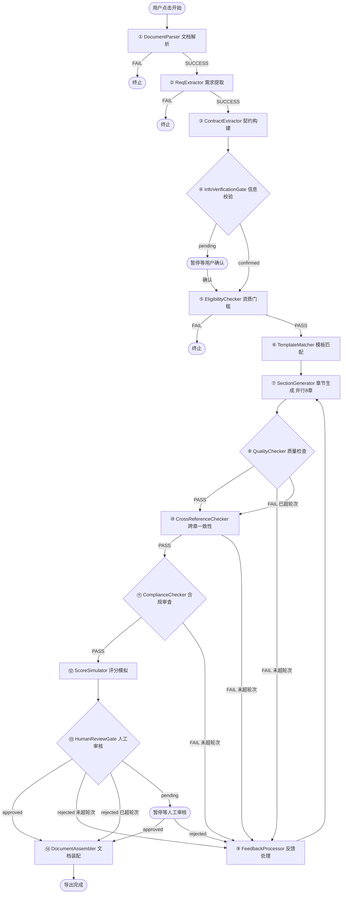

# 标书制作智能体 — 系统工作流全景文档

> **版本**：v1.0 | **日期**：2026-07-14 | **基于**：PRD + specs/001-009 + 源码

---

## 一、系统架构总览

系统采用 **LangGraph StateGraph** 编排的 **14 节点状态机管道**，通过 `AgentState`（TypedDict）作为统一状态对象在所有节点间流转。管道支持两阶段子图拆分（交互模式）和全量直通（无头模式）。

```
┌─────────────────────────────────────────────────────────────────────┐
│                        Streamlit GUI 层                              │
│    上传面板 │ 信息校验组件 │ 审阅面板 │ 配置面板 │ 导出面板          │
├─────────────────────────────────────────────────────────────────────┤
│                    Pipeline Runner（管道运行器）                      │
│         build_extraction_graph() / build_generation_graph()          │
├─────────────────────────────────────────────────────────────────────┤
│                      LangGraph 核心引擎层（14 节点）                  │
│  L0 解析 → L1 决策 → L2 需求 → L4 生成 → L5 校验 → L6 人工 → L7 封装 │
├─────────────────────────────────────────────────────────────────────┤
│                        基础设施层                                    │
│   FAISS 向量索引 │ LLM 多供应商适配器 │ 知识库 │ DOCX 引擎 │ 自进化 │
└─────────────────────────────────────────────────────────────────────┘
```

---

## 二、完整工作流图



### 管道两阶段拆分（交互模式）

```
Phase 1 提取阶段: DocumentParser → ReqExtractor → ContractExtractor → InfoVerificationGate → [暂停]
Phase 2 生成阶段: EligibilityChecker → TemplateMatcher → SectionGenerator → QualityChecker
                  → CrossReferenceChecker → ComplianceChecker → ScoreSimulator
                  → HumanReviewGate → DocumentAssembler → END
```

---

## 三、各节点功能与策略详解

### ① DocumentParser — 文档解析

| 维度 | 描述 |
|------|------|
| **层级** | L0 解析层 |
| **LLM 依赖** | 无（纯解析） |
| **输入** | 用户上传的文件（PDF/DOCX/DOC） |
| **输出** | `documents`（文件名+文本内容+文件类型）、`extracted_tables`（结构化表格） |

**支持的文件格式与解析策略**：

| 格式 | 主解析器 | 兜底方案 | 策略说明 |
|------|---------|---------|---------|
| **PDF** | PyMuPDF (fitz) `page.get_text()` | pdfminer.six | fitz 处理 CJK 优秀且速度快；fitz 异常时（加密/损坏/扫描件）自动降级到 pdfminer |
| **DOCX** | python-docx `Document(file_path)` | — | 验证 ZIP/OOXML 格式有效性，提取所有段落文本 |
| **DOC** | macOS textutil（原生） | Linux antiword → olefile 原始流提取 | 三级降级策略：系统命令转换 → 开源工具 → OLE 流裸提取 |

**表格结构化提取策略**：
- 使用 PyMuPDF 的 `page.find_tables()` API 从 PDF 中自动检测表格
- 按表头关键词自动分类表格类型：
  - **评分表**：含"评分""分值""得分""满分"等关键词
  - **资质表**：含"资质""资格""证书""认证"等关键词
- 输出结构化 JSON：`{page, header, rows, type, source}`
- 供下游 ReqExtractor **直接消费**，跳过 LLM 调用

**文本分块策略**：
- 默认 `chunk_size=1000`，`chunk_overlap=200`（可由上传面板配置 500-2000）
- 分块结果供 FAISS 索引和 LLM 截断使用

**失败处理**：
- 解析失败的文件标记 `status=FAILED` 并记录错误原因
- 至少 1 个文件成功才标记节点 `COMPLETED`
- 全部失败 → `route_after_parser` 路由到 END，终止管道

---

### ② ReqExtractor — 需求提取

| 维度 | 描述 |
|------|------|
| **层级** | L2 需求层 |
| **LLM 依赖** | ✅ 有（表格不足时） / ❌ 无（表格充足时） |
| **输入** | `documents`（解析后文本）、`extracted_tables`（结构化表格） |
| **输出** | `requirements`（评分项列表、资质要求、技术规格、格式规则） |

**信息提取策略 — 表格优先消费**：
1. **优先消费 DocumentParser 提取的结构化表格**（评分表、资质表），直接从 JSON 中解析评分项名称、分值、评审因素 → **跳过 LLM 调用**
2. 仅当表格数据不足时，才调用 LLM 从全文中提取剩余信息
3. LLM 提取的 prompt 要求返回 JSON 格式，包含：
   - `scoring`：评分项列表（名称、分值、评审因素）
   - `qualifications`：资质要求（企业资质门槛、人员资质）
   - `tech_specs`：技术规格（技术参数、服务标准）
   - `format_rules`：格式要求（页边距、字体、行距等）
4. 同时提取 `project_name`、`bid_number`、`tenderer_name`、`package_number`

**子类型识别策略**（spec/008 — 劳务外包子类型分区）：
- 触发条件：`bid_type` 包含"劳务外包"或"劳务管理服务"
- **三层识别**：
  - **Tier 1 关键词快速匹配**：计算各子类型关键词命中率，≥0.8 直接返回（高置信）
  - **Tier 2 LLM 辅助判断**：前 3000 字 + 关键词矩阵 → LLM 判断，confidence ≥0.7 返回
  - **Tier 3 用户确认**：返回 Top-3 候选 + 置信度，由 InfoVerificationGate 让用户选择
- 6 种子类型：食堂餐饮、工业生产线、HRO、保安保洁、仓储物流、BPO

**LLM 容错策略**：
- 三重 JSON 解析容错：直接解析 → 代码块提取（` ```json ... ``` `）→ 花括号提取（`{ ... }`）
- 重试 1 次仍失败则判定 FAILED，终止管道

---

### ③ ContractExtractor — 项目上下文契约构建

| 维度 | 描述 |
|------|------|
| **层级** | L2 需求层 |
| **LLM 依赖** | ✅ 有（从补充说明提取） / 正则兜底 |
| **输入** | `extra_reqs`（补充说明）、`requirements`（招标文件提取）、`bid_type`、`user_confirmed_fields` |
| **输出** | `project_contract`（契约 dict）、`global_constraints`（全局约束） |

**核心策略 — 四方合并优先级**：

```
用户校验确认（最高优先级）> 招标文件提取 > LLM 从补充说明提取 > 默认/空
```

**字段提取与改写**：
- LLM 从用户「补充说明」自由文本中提取结构化字段：
  - `bidder_name`（投标人）、`project_location`（项目地点）、`industry`（行业属性）
  - `duration`（工期）、`warranty`（质保期）、`service_target`（服务对象）
- 将策略性要求改写为规范的 `notes` 字段
- 与 ReqExtractor 输出进行交叉验证

**禁止出现项推断**：
- 自动推断 `forbidden_institutions`（禁止出现的机构名，防止拼凑残留）
- 自动推断 `forbidden_industries`（禁止涉及的行业属性）
- 例如：非复旦项目中不应出现"复旦大学"

**LLM 兜底策略**：
- 无 LLM 时使用正则提取：公司名模式匹配、城市名列表匹配、工期数字提取

**契约数据结构**（`ProjectContextContract`）：
- 注入每章生成 prompt，确保 8 章中项目名称、投标人、项目地点完全一致
- 含 `is_valid()` 校验必填字段、`to_dict()/from_dict()` 序列化

---

### ④ InfoVerificationGate — 信息校验门

| 维度 | 描述 |
|------|------|
| **层级** | 人工校验层（提取阶段与生成阶段之间） |
| **LLM 依赖** | 无 |
| **输入** | `requirements`、`project_contract`、`bid_type`、`bid_subtype` |
| **输出** | `info_verification_status`（pending/confirmed）、`info_summary`（关键信息摘要） |

**核心策略 — 前端拦截提取错误**：
- 在 LLM 生成前（最昂贵的操作前）插入人工校验，用最小成本拦截提取错误
- 与末端 `HumanReviewGate` 形成"前门+后门"双重校验

**展示内容**：
- 11 个关键字段的可编辑表单（项目名称、招标编号、招标人、包件号、投标人、项目地点、行业、工期、质保期、服务对象、子类型）
- 每个字段标注提取来源（招标文件/补充说明/LLM/用户填写/缺失）
- 提取摘要统计（评分项 N 条、资质要求 N 条）
- 冷启动状态提示（子类型数据不足时建议入库更多标书）

**两种工作模式**：
- **交互模式（GUI）**：设置 `pending` → 暂停管道 → GUI 展示表单 → 用户确认后 `apply_user_corrections()` 注入修正值 → 恢复 Phase 2
- **无头模式（CI）**：`auto_confirm=True` → 自动通过，不暂停

---

### ⑤ EligibilityChecker — 资质门槛校验（Go/No-Go 门禁）

| 维度 | 描述 |
|------|------|
| **层级** | L1 决策层 |
| **LLM 依赖** | 无（规则匹配） |
| **输入** | `requirements.qualifications`、企业资质库（`data/company_quals.json`） |
| **输出** | `eligibility_report`（verdict: PASS/FAIL/WARNING，缺失/匹配资质，风险等级） |

**核心策略 — 9 类软要求自动过滤**：

将招标文件中的资质要求分为"硬资质"（可验证的证书）和"软要求"（通用法定要求），仅对硬资质进行证书匹配：

| 类别 | 示例 | 处理 |
|------|------|------|
| 通用法定要求 | 政府采购法第22条、独立法人资格 | 自动通过 |
| 业绩/案例要求 | "提供同类项目合作案例" | 自动通过（标书正文回应） |
| 文档/流程要求 | "提供服务标准、流程及制度" | 自动通过 |
| 状态/声明要求 | "已通过资格预审" | 自动通过 |
| 通用能力声明 | "具有履行合同所必需的设备" | 自动通过 |
| 财务文件要求 | "提供财务报表、纳税证明" | 自动通过 |
| 法人/身份证件 | "法定代表人授权书" | 自动通过 |
| 兜底提交要求 | "提供其他资质、资格证书等" | 自动通过 |
| 发票能力要求 | "能开具增值税专用发票" | 自动通过 |

**证书匹配策略**：
- 归一化处理：去除"认证""证书""资质""许可"等后缀
- 模糊匹配：归一化后子串包含匹配（`ISO9001` 匹配 `ISO9001质量管理体系认证`）

**门禁路由**：
- `FAIL`（硬门槛不满足）→ **终止管道**，避免浪费 8 章生成成本
- `WARNING`（部分缺失但有替代）→ 继续，等待用户确认
- `PASS` → 继续 TemplateMatcher

---

### ⑥ TemplateMatcher — 模板匹配

| 维度 | 描述 |
|------|------|
| **层级** | L2 需求层 |
| **LLM 依赖** | 无 |
| **输入** | `bid_type`、`bid_subtype`、招标文件文本 |
| **输出** | `matched_templates`（Top-3 模板 ID 列表）、`selected_template_id` |

**双模式检索策略**：

| 模式 | 引擎 | 策略 | 用途 |
|------|------|------|------|
| **FAISS 语义检索** | faiss-cpu + OpenAI text-embedding-3-small (1536维) | 向量余弦相似度 Top-K | 精确语义匹配 |
| **文件系统关键词检索** | 文件系统遍历 + 关键词命中 | 评分式排序 | 兜底（FAISS 不可用时） |

**子类型分区检索**（spec/008）：
- 劳务外包类知识库按子类型分区（HRO/食堂餐饮/工业生产线/...）
- 检索权重动态调整：

| 子类型数据量 | 子类型权重 | _shared 权重 | 最近邻权重 |
|:--:|:--:|:--:|:--:|
| 0（冷启动） | 0.0 | 0.7 | 0.3 |
| 1-4（不足） | 1.0 | 0.3 | 0.0 |
| ≥5（正常） | 1.0 | 0.0 | 0.0 |

- `_shared` 严格准入：仅格式固定型章节（投标函、授权委托书等）可进入通用区
- 冷启动时回退到 `_shared/chapters/` + 最相似子类型推荐

---

### ⑦ SectionGenerator — 章节生成（并行 8 章）

| 维度 | 描述 |
|------|------|
| **层级** | L4 生成层 |
| **LLM 依赖** | ✅ 必须有 LLM |
| **输入** | `requirements`、`selected_template_id`、`bid_type`、`bid_subtype`、`project_contract`、`feedback_history` |
| **输出** | `sections`（章节名→内容映射） |

**8 章标准结构**：

| 章节 | 键名 | 说明 |
|------|------|------|
| 第一章 投标函 | `ch1_letter` | 格式固定型 |
| 第二章 法定代表人授权委托书 | `ch2_authorization` | 格式固定型 |
| 第三章 服务方案 | `ch3_service` | 差异化（子类型适配） |
| 第四章 技术方案 | `ch4_technical` | 差异化 |
| 第五章 人员配置 | `ch5_staffing` | 差异化 |
| 第六章 公司资质与业绩 | `ch6_qualifications` | 差异化 |
| 第七章 项目实施计划 | `ch7_schedule` | 差异化 |
| 第八章 售后服务承诺 | `ch8_after_sales` | 差异化 |

**6 重 Prompt 注入策略**：

| 策略 | 说明 |
|------|------|
| **契约注入** | 每章 prompt 注入 `ProjectContextContract` 摘要，确保全篇项目名称/投标人/地点一致 |
| **RAG 注入** | 从知识库 FAISS 检索同类型历史中标方案的优质段落，注入 prompt 作为参考 |
| **评分对齐** | 每章 prompt 包含招标文件评分要求，确保逐条响应评分项 |
| **类型适配** | 根据 `bid_type` 选择差异化 prompt（如劳务管理服务类使用真实标书 7 子节结构） |
| **防虚构指令** | 注入 `NO_FABRICATION_DIRECTIVE`：人员/企业/证书/财务/业绩等 8 类真实数据严禁编造，必须用 `【待填写：具体说明】` 占位符 |
| **互斥一致性指令** | 注入互斥方式规则：银行保函 vs 转账、总价包干 vs 单价计价等，同一章节只能选一种 |

**附加注入**：
- **Mermaid 图表指令**：人员架构/工作流程/组织层级章节必须使用 Mermaid 语法绘制图表
- **表格模板注入**：生成资格审查章节时，从 `patterns/` 目录加载结构化表格 JSON 转为 Markdown 注入
- **一致性经验注入**：从 `ConsistencyLessonStore` 加载积累的经验规则，注入 prompt 避免同类问题重复出现

**并行生成与错误隔离**：
- 8 章通过 `ThreadPoolExecutor` 并行生成
- 单章 LLM 调用超时/失败不影响其他章节
- 失败章使用错误占位符 `【生成失败：章节名 — 请手动补充】`

**定向修订策略**：
- 读取 `feedback_history`，仅对有反馈的章节强制重新生成
- 未被反馈的章节保留原内容（`if name in existing and existing[name]: return`）
- 支持多轮迭代（默认 3 轮，可配置 1-5 轮）

---

### ⑧ QualityChecker — 质量检查

| 维度 | 描述 |
|------|------|
| **层级** | L5 校验层（第一道关） |
| **LLM 依赖** | ✅ 有 / 启发式兜底 |
| **输入** | `sections`、`requirements.scoring`、`feedback_history` |
| **输出** | `quality_report`（verdict: PASS/FAIL，0-100 分，完整度/合规度/一致度问题清单） |

**检查策略**：
- **评分项覆盖率检查**：逐条比对评分标准与章节内容，检测遗漏的评分项
- **内容完整度**：每章至少检查 8000 字
- **分类问题清单**：完整度问题 / 合规度问题 / 一致度问题

**LLM 容错**：
- 非 JSON 响应不再静默 PASS
- 三重 JSON 解析容错 → 重试 1 次仍失败 → 判定 FAIL
- 无 LLM 时回退到启发式规则（基于内容长度和关键词覆盖率估算）

**路由策略**：
- PASS → CrossReferenceChecker
- FAIL + `current_round < max_rounds` → FeedbackProcessor（反馈循环）
- FAIL + `current_round >= max_rounds` → 强制通过到 CrossReferenceChecker（防止无限循环）

---

### ⑨ FeedbackProcessor — 反馈处理

| 维度 | 描述 |
|------|------|
| **层级** | 反馈循环层 |
| **LLM 依赖** | ✅ 有 / 关键词分类兜底 |
| **输入** | `quality_report`/`cross_ref_report`/`compliance_report` 中的问题 + `review_comments` |
| **输出** | 更新后的 `feedback_history`、递增的 `current_round` |

**反馈分类策略**：

| 类型 | 代号 | 触发场景 | 修复方式 |
|------|------|---------|---------|
| 内容修正 | `content_fix` | 评分项未覆盖、内容缺失 | 章节内追加段落 |
| 风格调整 | `style_adjust` | 表述风格不符 | 重新措辞 |
| 结构优化 | `structure` | 章节结构不合理 | 重组段落 |
| 评分对齐 | `score_align` | 评分项未逐条响应 | 按评分标准逐条回应 |

**作用域识别**：
- `global`：影响全篇（如项目名称错误）→ 所有章节需重新生成
- `local`：影响特定章节/段落 → 仅重生成目标章节

**三层反馈历史管理**：
1. **Layer 1 — `global_constraints`**：全局约束，永不丢弃
2. **Layer 2 — `compressed_history`**：旧轮次反馈的摘要
3. **Layer 3 — `context_window_size`（默认 3）**：最近 N 轮反馈完整保留

**一致性自进化触发**（spec/007）：
- 处理一致性问题时自动调用 `ConsistencyLessonExtractor` 提取经验
- 经验持久化到 `data/consistency_lessons.json`
- 后续生成时自动注入到 prompt

**路由**：
- 始终返回 `SectionGenerator`（触发定向修订）

---

### ⑩ CrossReferenceChecker — 跨章节一致性校验

| 维度 | 描述 |
|------|------|
| **层级** | L5 校验层（第二道关） |
| **LLM 依赖** | 无（规则匹配） |
| **输入** | `sections`、`project_contract` |
| **输出** | `cross_ref_report`（verdict: PASS/FAIL，不一致项列表） |

**检查项**：

| 检查维度 | 示例 | 严重程度 |
|---------|------|---------|
| 人员数量跨章一致 | 人员配置章写"15人" vs 服务方案章写"12人" | high |
| 技术参数跨章一致 | 技术方案"响应时间≤2h" vs 服务方案"响应时间≤4h" | high |
| 时间节点跨章一致 | 实施计划"30天完成" vs 服务方案"45天完成" | high |
| 金额跨章一致 | 报价章"¥920,000" vs 其他章"¥850,000" | high |
| 契约偏离 | 某章出现契约禁止的机构名（如非复旦项目出现"复旦大学"） | CRITICAL |
| 拼凑残留 | 错误出现其他项目的行业属性 | CRITICAL |

**路由**：
- PASS → ComplianceChecker
- FAIL + `current_round < max_rounds` → FeedbackProcessor

---

### ⑪ ComplianceChecker — 合规审查（格式 + 法律）

| 维度 | 描述 |
|------|------|
| **层级** | L5 校验层（第三道关） |
| **LLM 依赖** | 无（正则匹配） |
| **输入** | `sections`、`requirements.format_rules` |
| **输出** | `compliance_report`（verdict: PASS/FAIL，格式问题列表，法律问题列表） |

**格式合规检查**：
- 页边距（上下左右）、字体（仿宋/黑体）、行距
- 目录格式、附件顺序、页眉页脚
- 缺失格式字段或 `seal_requirement` 缺失时报警

**法律合规检查**：

| 检查项 | 检测模式 | 法律依据 | 示例 |
|--------|---------|---------|------|
| 绝对化用语 | 上下文敏感正则匹配 | 广告法 | "全国第一""唯一""最佳" |
| 虚假业绩 | 无对应合同的项目 | 招标投标法 | 未经验证的项目业绩 |
| 知识产权 | 未授权使用他人案例/图片 | 著作权法 | — |
| 保密信息泄露 | 客户名称未脱敏 | 保密法 | — |

**上下文敏感匹配策略**：
- 避免"第一"在"第一名投标候选人"中误报（合法使用）
- 使用正则 `(?<!候选人)第一` 等上下文排除模式

**路由**：
- PASS → ScoreSimulator
- FAIL + `current_round < max_rounds` → FeedbackProcessor

---

### ⑫ ScoreSimulator — 评分模拟

| 维度 | 描述 |
|------|------|
| **层级** | L5 校验层（第四道关） |
| **LLM 依赖** | ✅ 有 / 启发式兜底 |
| **输入** | `sections`、`requirements.scoring` |
| **输出** | `score_simulation`（逐项得分/总分/排名预估/方法） |

**双模式策略**：

| 模式 | 条件 | 策略 |
|------|------|------|
| **LLM 模式** | LLM 可用 | 模拟评审专家逐项打分，精确预测 |
| **启发式模式** | 无 LLM | 基于内容覆盖率（中文 2-gram 分词）和篇幅长度估算 |

**输出内容**：
- 每个评分项的预测得分、gap（与满分差距）、改进建议
- 总分 = 各项之和
- 排名预估（前3/中上/中等/偏后）

---

### ⑬ HumanReviewGate — 人工审核卡点

| 维度 | 描述 |
|------|------|
| **层级** | L6 人工层 |
| **LLM 依赖** | 无 |
| **输入** | `sections`、`score_simulation`、`quality_report` |
| **输出** | `review_status`（pending/approved/rejected）、`review_comments` |

**法律依据**：招标投标法第二十七条规定投标文件需由法定代表人或授权代理人签字并加盖公章。完全自动化在法律层面不可接受。

**两种工作模式**：
- **交互模式（GUI）**：`auto_approve=False` → 设置 `pending` → 暂停管道 → GUI 展示章节内容、预测得分、质量报告 → 用户选择通过/驳回
- **无头模式（CI）**：`auto_approve=True` → 自动通过

**幂等设计**：
- 已有 verdict 不被覆盖
- 支持 GUI 二次 invoke

**路由策略**：
- `approved` → DocumentAssembler
- `rejected` + `current_round < max_rounds` → FeedbackProcessor（审核意见自动转为 `feedback_history` 条目）
- `rejected` + `current_round >= max_rounds` → 强制 DocumentAssembler
- `pending` → END（暂停等待人工输入）

---

### ⑭ DocumentAssembler — 文档装配

| 维度 | 描述 |
|------|------|
| **层级** | L7 封装层 |
| **LLM 依赖** | 无 |
| **输入** | `sections`、`requirements.format_rules` |
| **输出** | `export_path`（DOCX 文件路径） |

**DOCX 装配策略**：

| 维度 | 策略 |
|------|------|
| **字体** | 正文仿宋_GB2312、标题黑体/楷体，符合政府采购格式 |
| **字号** | 正文小四号(12pt)、标题按级别递减(16→14→13→12pt) |
| **页边距** | 从 `format_rules` 读取，默认上下3.7cm/左右2.8cm |
| **行距** | 从 `format_rules` 读取，默认 28 磅固定行距 |
| **目录** | 自动生成目录（Tab 前导符 + 页码） |
| **页码** | 连续页码 |
| **页眉页脚** | 支持自定义 |

**Markdown 渲染策略**：
- **标题**：`##` → 二级标题（黑体14pt），`###` → 三级标题（楷体13pt）
- **表格**：Markdown 表格 → Word 表格（自动列宽）
- **列表**：有序/无序列表正确渲染
- **加粗**：`**text**` → 加粗显示

**Mermaid 图表渲染**：
- 检测 ` ```mermaid ` 代码块
- 使用 matplotlib 后端将 Mermaid 语法渲染为图片
- 自动布局：力导向算法计算节点位置，箭头连接，支持边标签
- 图片插入到 DOCX 对应位置

**占位符渲染**：
- `【待填写：...】` 格式的占位符 → **红色加粗** 显示，提醒投标人手动填写
- 正则匹配：`【待填写[：:][^】]+】`

**签章页**：
- 最后自动添加签章页，显示 seal_requirement（如"加盖公章"）

---

## 四、横切关注点

### 4.1 LLM 多供应商适配

| 供应商 | 模型 | 用途 |
|--------|------|------|
| DeepSeek | deepseek-chat / deepseek-reasoner | 默认模型（生成、提取、质检） |
| OpenAI | gpt-4o / gpt-4o-mini | 可选（embedding 或备选） |
| Anthropic | claude-3.5-sonnet | 可选（质量检查专用） |

- **注入机制**：`functools.partial` 预绑定 `llm_fn` 到节点函数，绕过 LangGraph `add_node` 不支持 kwargs 的限制
- **节点级路由**：可为不同节点配置不同模型（如生成用 GPT-4o、质检用 Claude）
- **API Key 管理**：内存暂存，不持久化到磁盘；存储在 `~/.bid-agent/config.json`（项目目录外）

### 4.2 FAISS 向量检索管线

**六步检索管线**（`RetrievalPipeline`）：
1. Query 向量化（OpenAI text-embedding-3-small, 1536 维）
2. 多索引并行搜索
3. RRF（Reciprocal Rank Fusion）融合排序：`score(d) = Σ 1/(k + rank_i(d))`
4. 去重
5. 元数据过滤
6. 结果截断（Top-K）

### 4.3 一致性自进化系统（spec/007）

```
CrossReferenceChecker / ComplianceChecker / QualityChecker
    │ 发现一致性问题
    ↓
ConsistencyLessonExtractor → 从问题中提取可复用规则
    ↓
ConsistencyLessonStore (data/consistency_lessons.json) → 持久化、去重、累加
    ↓
SectionGenerator._get_section_prompt() → 将经验注入 prompt
    ↓
LLM 生成时遵守经验规则 → 减少同类问题
```

- 去重策略：Jaccard 相似度 + 章节重叠检测
- 经验合并：相同经验的 keywords 合并、occurrence_count 递增
- 查询：按章节和 bid_type 筛选，按 occurrence_count 降序排列

### 4.4 知识库结构

```
knowledge_base/
├── 服务类/          # 6 种标书类型 × (模板 + 范文 + 招标文件 + 中标方案 + 中标公告)
├── 货物类/
├── 工程类/
├── 运维类/
├── 集成类/
├── 劳务外包类/      # 含子类型分区
│   ├── _shared/    # 跨子类型通用内容（格式固定型章节）
│   ├── HRO/        # 子类型分区：chunks/ + patterns/ + prompts/ + manifest.json
│   ├── 食堂餐饮/
│   ├── 工业生产线/
│   └── ...
└── 劳务管理服务类/
```

### 4.5 超大文件策略（spec/009 — 设计中）

针对 >200MB 招标文件的流式解析方案：
- 逐页流式解析替代一次性全量加载
- 倒排索引 + LRU 缓存（200 页）实现按需检索
- PaddleOCR 进程池并行处理扫描件
- 章节自动切分 + 断点续传
- 原子写入 + 哈希校验保证数据完整性

---

## 五、管道运行模式

### 5.1 交互模式（GUI）

```python
# Phase 1: 提取阶段
extraction_graph = build_extraction_graph(llm_fns)
result = extraction_graph.invoke(state)
# → InfoVerificationGate 暂停 → GUI 展示校验表单 → 用户确认

# Phase 2: 生成阶段
apply_user_corrections(result, corrected_fields)
generation_graph = build_generation_graph(llm_fns)
final_result = generation_graph.invoke(result)
# → HumanReviewGate 暂停 → GUI 展示审阅界面 → 用户通过/驳回
```

### 5.2 无头模式（CI/测试）

```python
# 全量直通，InfoVerificationGate 和 HumanReviewGate 均自动通过
graph = build_graph(llm_fns)
result = graph.invoke(state)
```

### 5.3 快照导出模式

```python
# 每个节点执行后保存 JSON 快照，支持断点分析
result, snapshots = run_pipeline_with_snapshots(state, export_dir)
```

---

## 六、节点 LLM 依赖汇总

| # | 节点 | LLM | 回退方案 |
|---|------|:--:|---------|
| 1 | DocumentParser | ❌ | — |
| 2 | ReqExtractor | ✅ | 表格结构化数据直接消费 |
| 3 | ContractExtractor | ✅ | 正则提取基本信息 |
| 4 | InfoVerificationGate | ❌ | — |
| 5 | EligibilityChecker | ❌ | — |
| 6 | TemplateMatcher | ❌ | 文件系统关键词检索 |
| 7 | SectionGenerator | ✅ | 无（必须 LLM） |
| 8 | QualityChecker | ✅ | 启发式规则 |
| 9 | FeedbackProcessor | ✅ | 关键词分类 |
| 10 | CrossReferenceChecker | ❌ | — |
| 11 | ComplianceChecker | ❌ | — |
| 12 | ScoreSimulator | ✅ | 启发式评分 |
| 13 | HumanReviewGate | ❌ | — |
| 14 | DocumentAssembler | ❌ | — |

---

## 七、条件路由汇总

| 路由函数 | 触发节点 | 条件 | 去向 |
|---------|---------|------|------|
| `route_after_parser` | DocumentParser | FAILED | END |
| | | SUCCESS | ReqExtractor |
| `route_after_extraction` | ReqExtractor | FAILED | END |
| | | SUCCESS | ContractExtractor |
| `route_after_verification` | InfoVerificationGate | confirmed | EligibilityChecker |
| | | pending | END（暂停） |
| `route_after_eligibility` | EligibilityChecker | FAIL | END |
| | | PASS/WARNING | TemplateMatcher |
| `route_after_quality_check` | QualityChecker | PASS | CrossReferenceChecker |
| | | FAIL + 未超轮次 | FeedbackProcessor |
| | | FAIL + 已超轮次 | CrossReferenceChecker（强制通过） |
| `route_after_cross_ref` | CrossReferenceChecker | PASS | ComplianceChecker |
| | | FAIL + 未超轮次 | FeedbackProcessor |
| `route_after_compliance` | ComplianceChecker | PASS | ScoreSimulator |
| | | FAIL + 未超轮次 | FeedbackProcessor |
| `route_after_feedback` | FeedbackProcessor | — | SectionGenerator（始终返回修订） |
| `route_after_review` | HumanReviewGate | approved | DocumentAssembler |
| | | rejected + 未超轮次 | FeedbackProcessor |
| | | rejected + 已超轮次 | DocumentAssembler（强制） |
| | | pending | END（暂停） |

---

## 八、AgentState 核心字段

| 字段 | 类型 | 生产节点 | 说明 |
|------|------|---------|------|
| `documents` | `list[dict]` | DocumentParser | 解析后的文件内容 |
| `extracted_tables` | `list[dict]` | DocumentParser | 结构化表格 |
| `bid_type` | `str` | 用户输入 | 标书类型 |
| `bid_subtype` | `str` | ReqExtractor | 劳务外包子类型 |
| `requirements` | `dict` | ReqExtractor | 评分项/资质/技术规格/格式规则 |
| `project_contract` | `dict` | ContractExtractor | 项目上下文契约 |
| `info_verification_status` | `str` | InfoVerificationGate | pending/confirmed |
| `eligibility_report` | `dict` | EligibilityChecker | 资质校验报告 |
| `matched_templates` | `list[str]` | TemplateMatcher | Top-3 模板 ID |
| `sections` | `dict[str,str]` | SectionGenerator | 章节名→内容 |
| `quality_report` | `dict` | QualityChecker | 质量检查报告 |
| `cross_ref_report` | `dict` | CrossReferenceChecker | 跨章一致性报告 |
| `compliance_report` | `dict` | ComplianceChecker | 合规审查报告 |
| `score_simulation` | `dict` | ScoreSimulator | 评分模拟结果 |
| `review_status` | `str` | HumanReviewGate | pending/approved/rejected |
| `feedback_history` | `list[dict]` | FeedbackProcessor | 反馈历史 |
| `current_round` | `int` | FeedbackProcessor | 当前修订轮次 |
| `max_rounds` | `int` | 用户配置 | 最大修订轮次（默认3） |
| `export_path` | `str` | DocumentAssembler | DOCX 文件路径 |
| `node_status` | `dict` | 全部节点 | 各节点执行状态 |
